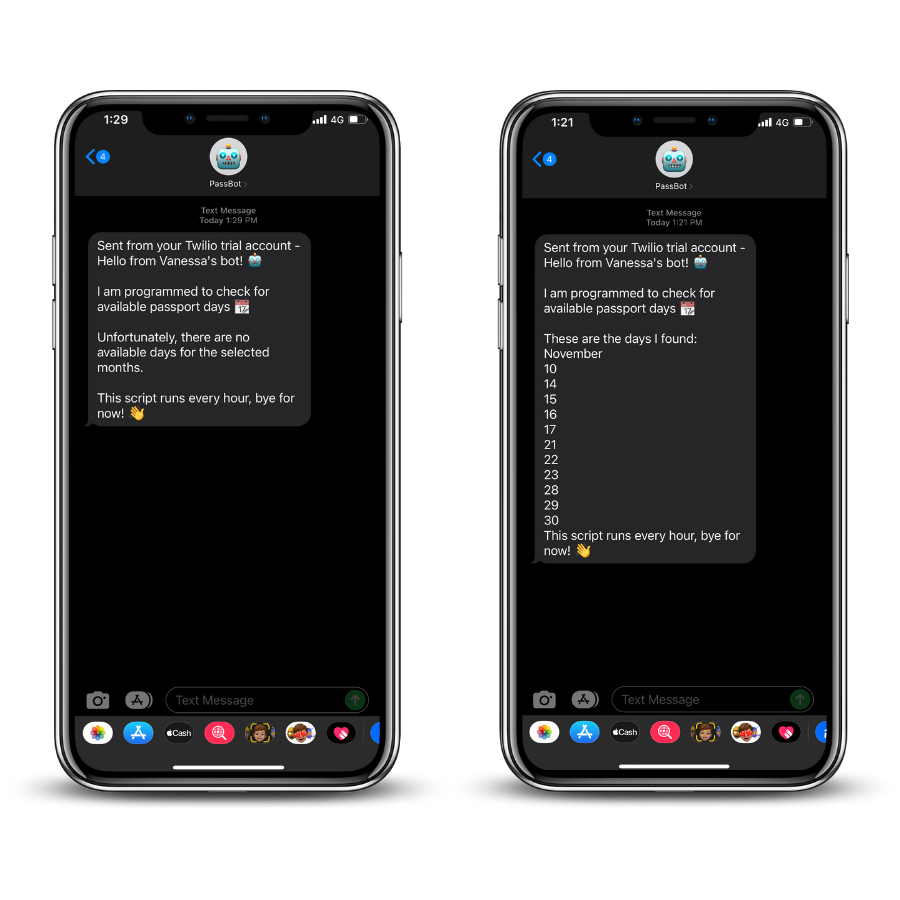

# Passport Appointment Bot

Passport Appointment Bot is a web scraping script to notify via SMS available days for passport appointment times at selected US Embassy.

Built with:
* [Selenium](https://pypi.org/project/selenium/ "Selenium")
* [Webdriver Manager](https://github.com/SergeyPirogov/webdriver_manager "Webdriver Manager")
* [Twilio API](https://www.twilio.com/ "Twilio API")

<center></center>

## 🛠️ Installs 

Install Selenium to automate browser
```python
pip install selenium
```

Install Webdriver Manager to ensure driver version is correct for your browser - third party library provided by [Sergey Pirogov](https://github.com/SergeyPirogov "Sergey Pirogov")
```python
pip install webdriver-manager
```

Install Twilio to access text messaging API
```python
pip install twilio
```

## 📱 Setup SMS Messaging with Twilio

1. [Create an account with Twilio](https://www.twilio.com/ "Create an account with Twilio") and get an SMS-enabled Twilio phone number. As of this writing, Twilio offers free accounts with a $15 credit.
2. Copy your account SID and auth token, paste them into the appropriate spot in PassBot.py.
3. Add your mobile phone number and your Twilio number to PassBot.py.
4. Add the name of your choosing to the body of the text message in PassBot.py.

## 🤖 Automate

You can automate the script by creating a task in [task scheduler](https://www.jcchouinard.com/python-automation-using-task-scheduler/ "task scheduler") for Windows or by creating a [cron job](https://betterprogramming.pub/https-medium-com-ratik96-scheduling-jobs-with-crontab-on-macos-add5a8b26c30 "cron job") for macOS and Linux.
